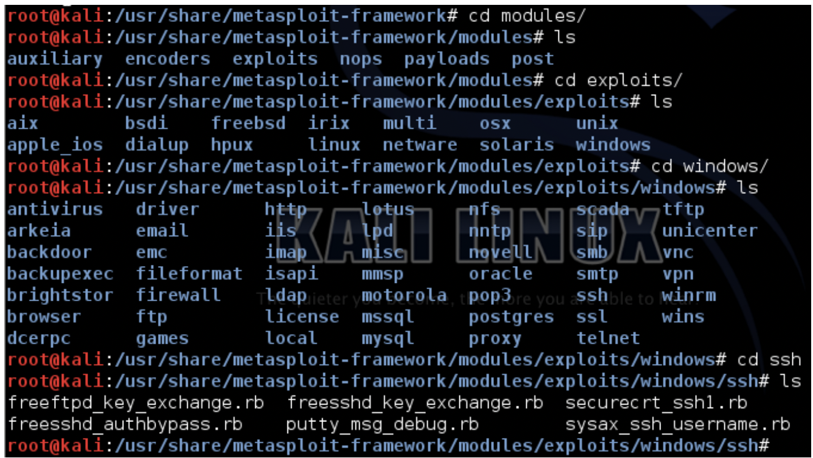

# MeTaSPLoiT
 

!!!danger "Perill!"
    **No proveu açò fora d'ún entorn didáctic. Podria ser un delicte.**

## MÓDULOS 

* **Auxiliary:** Permite la interacción de herramientas externas como pueden ser:** Escaners de vulnerabilidades, Sniffers, etc... con el framework de Metasploit 
* **Encoders:** Proporciona algoritmos par codificar y ofuscar los payloads que utilizaremos tras haber tenido éxito el exploit 
* **Exploits:** Aquí se encuentran todos los exploits disponibles en el “framework” para conseguir acceso a los diferentes SO’s 
* **Payloads:** Nos proporciona gran cantidad de códigos “maliciosos” que podremos ejecutar una vez haya tenido éxito el “exploit” 
* **Post:** Nos proporciona funcionalidades para la fase de “post” explotación como recolección de información, etc... 
* **Nops:** Nos permite realizar u obtener operaciones NOP para evadir antivirus, IDS, etc... 
### **Estructura de directorios (Importante)**
`Modules/exploits/<OS/Platform>/<Protocol/Service/Local...>/file.rb `

## INTRO A METASPLOIT FRAMEWORK
* Lanzamos la orden **msfconsole** desde el terminal que nos devolverá el identificador **msf >** para introducir las órdenes.
* Previamente será bueno actualizarlo: **root@kali.~# msfupdate**
* La consola MSF es como un mini-sistema de archivos donde las carpetas que cuelgan de él se encuentran físicamente en la ruta dónde se ha instalado el framework. Ejemplos:
    * Los exploits de Windows esta en la ruta **exploit/windows/<..>**
    * Los módulos auxiliares en **auxiliary/<...>**
    * Los encoders en **encoders/<tecnologia>**

## COMANDOS BÁSICOS

### **Órdenes de ayuda**

    * msf > `help –` lista las órdenes separadas en dos listados:

        * Órdenes del núcleo de msf
        * Órdenes de interacción con bases de datos.
        * -h permite obtener información de órdenes concretas.

### **Orden de búsqueda**
  * msf > `help –` lista las órdenes separadas en dos listados:

        * Órdenes del núcleo de msf
        * Órdenes de interacción con bases de datos.
        * -h permite obtener información de órdenes concretas.

### **Orden de búsqueda**

Útil para la búsqueda de módulos por alguna característica o determinar si elframework esta actualizado.
    * msf > `search -h`

* info – aporta información sobre el módulo seleccionado bien con la orden use (que permite seleccionar un módulo), bien especificando la ruta:
    * msf > `use exploit/multi/handler`
    * msf > `info`
    * msf > `info <ruta>`
* show – muestra las diferentes opciones para los módulos del framework, exploits,payload, encoders, nops, etc.
### **Órdenes de interacción y configuración**
* back – permite salir del módulo (contrario a use)
* set y setg – asignan valores a variables: set para un módulo, setg para en contexto del framework.
* unset y unsetg – desasignan valores a parámetros o variables
* connect – permite conectarnos a otra máquina para su gestión o administración dado la dirección IP y el puerto.
* irb – permite ejecutar un interprete de Ruby para el framework para ejercutar órdenes y scripts.
* load, unload y loadpath – load/unload especifica el plugins a cargar/descargar, o directorio donde se almacenan (loadpath).
* check – permite verificar si un sistema es vulnerable a cierta vulnerabilidad antes de lanzar el script.

* **exploit** – lanza el código malicioso, una vez seleccionado y configurado el módulo, sobre la máquina, o prepara el entorno para vulnerar la máquina. Devuelve el control mediante un shell o un Meterpreter (Meta-interprete: payload que permite cargar e inyectar en un programa del sistema atacado las extensiones que hemos desarrollado en formato .dll).

  * Opciones:
        * -j ejecutar exploit en segundo plano
        * -z no se interactúa con la sesión tras explotación exitosa
        * -e lanza el paylod con la codificación establecida
* sessions – las shells obtenidas en sistemas vulnerados se organizan por sesiones. Esta orden permite ver las sesiones que tenemos abiertas:
    * -l lista sesiones disponibles
    * -v muestra información extra
    * -s **script** ejecuta script sobre todas las sesiones del Meterpreter
    * -K finaliza todas las sesiones abiertas
    * -c <orden> ejecutar órdenes sobre sesiones abiertas del meterpreter
    * -u permite actualizar la shell remota tipo Win32 a un meterpreter especificando la sesión.
    * -i especifican sesión con la que interaccionar.
* resource – permite la carga de un archivo (.rc) con acciones especificas sobre el framework para automatizar tareas.
* makerc – almacena en un archivo el historial de órdenes y acciones que se han realiza en la sesión en curso (nombre-usuario en el directorio .msfX)
* save – aporta persistencia a la configuración del entorno, especialmente es test complicados y largos (archivo config en .msfX).
* jobs – muestra/finaliza los módulos en ejecución en segundo plano
* run – permite ejecutar un módulo auxiliar cargado en el contexto de la consola.
* route – enruta sockets a sesiones (similar al route de Linux). Útil en pivoting
                   